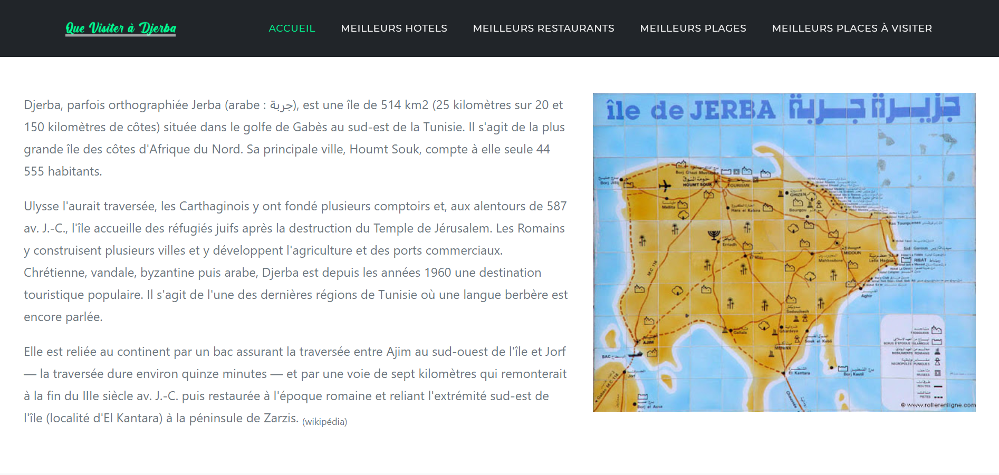

The project 'Que Visiter A Djerba' was made with Angular 9.1.2
for the Front-End and Firebase for the Back-End.

You can check the demo on YouTube : https://youtu.be/XJ-sb_0aoVI

These are some screenshots of the website application :

Small devices vue :

